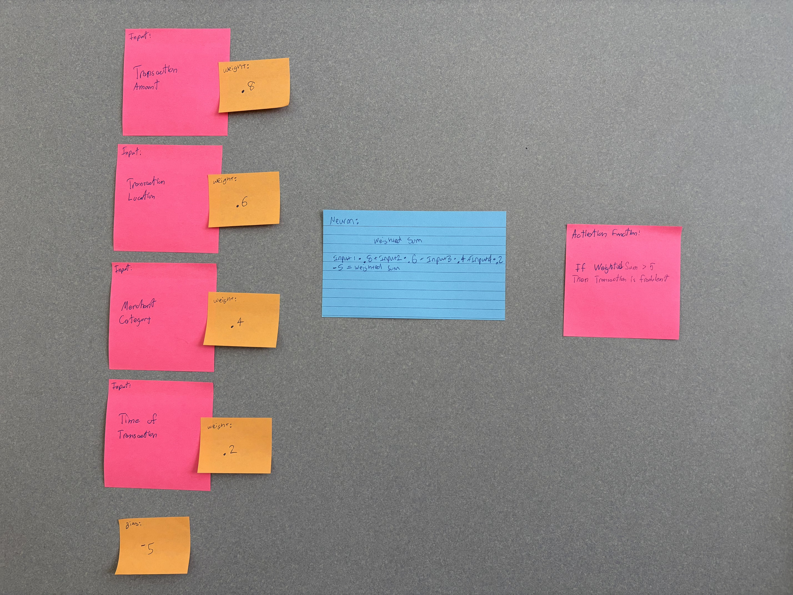

# Names: Aidan Dyga, Caleb Kendra

## Model

## Example

* Transaction Amount: 2
* Weight One: .8
* Transaction Location: 5
* Weight Two: .6
* Merchant Category: 5
* Weight Three: .4
* Time of Transaction: 5
* Weight Four: .2
* Bias: -5

* (Transaction Amount x Weight One) + (Transaction Location x Weight Two) + (Merchant Category x Weight Three) + (Time of Transaction x Weight Four) + Bias = Weighted Sum
* (2*.8)+(5*.6)+(5*.4)+(5*.2)-5=2.6

2.6 < 5 so our prediction is that the transaction is not fraudulent

## Performance

Did the network's output make sense?

* Yes, we think the network's output made sense given the weights and inputs. The weighted sum was calculated to be 2.6, which is less than the threshold of 5, indicating that the transaction is not fraudulent.

How could you adjust weights or activation functions to improve accuracy?

* To improve accuracy, we could adjust the weights based on the importance of each feature. For example, if the transaction location is more indicative of fraud, we could increase its weight. Additionally, we could experiment with different activation functions or thresholds to better capture the patterns in the data.

What did you notice about how small changes (e.g., weights) affect outcomes?

* We noticed that small changes in weights can significantly affect the outcomes. For instance, increasing the weight of the transaction amount slightly could push the weighted sum above the threshold, changing the prediction from non-fraudulent to fraudulent.

### Ethics

What potential biases or ethical considerations could arise in your example scenario?

* The biggest source of bias would be all the factors that we did not consider when making this model. When dealing with fraudulent transactions, there could be any number of sources that could influence whether a transaction is harmful or not. So in order to make this model as accurate as possible, research needs to be done to make sure that all possible influences to fraudulent transactions are found and addressed.
* An ethical side to this idea would be looking at how the data used for the inputs is collected, consent from users to take this data and feed it into our model would need to be granted to make sure that the model is not using private data unethically.

### Reflection

What was easy to understand about the neural network?

* How the inputs and weights worked was the easiest part as it simply let us know what factors played a role in the construction of the model and what factors have more weight then others.

What challenges did they face?

* Figuring out what the neurons and how they function in relation to the result, weights, and inputs was difficult at first as figuring out the calculation and how it relates to the overall goal could be difficult depending on the specific scenario you find yourself in.